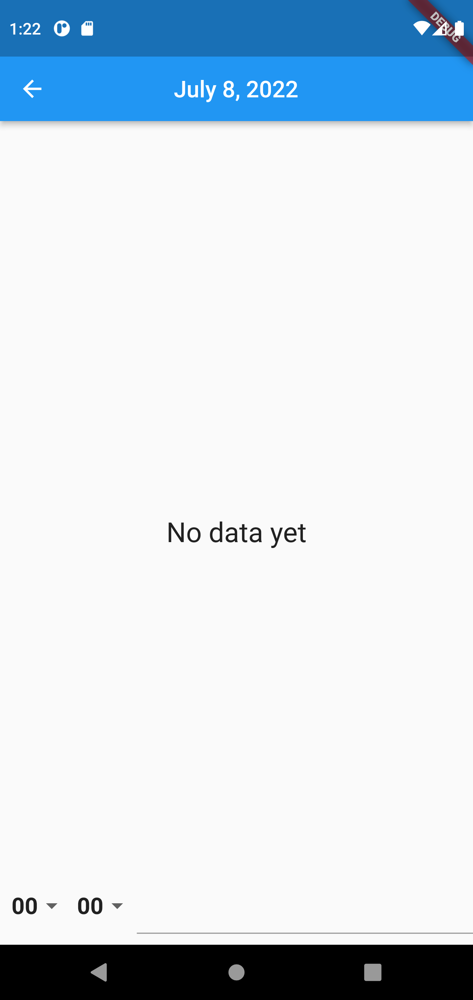

# Calendar (self written)
App was written with using of Clean Architecture, Drift Database and Bloc as state manager.

# Functionality
It is possible to add, delete and watch tasks by day in the calendar.

## Screenshots from the program

Calendar screen

Second screen without tasks

Second screen with tasks

